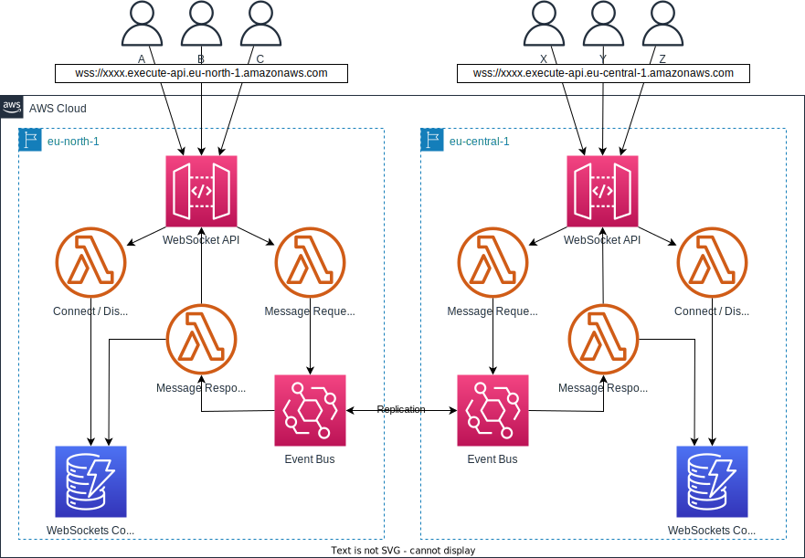

# ChatApp

Serverless multi region chat api example using .net 6, AWS Lambda, DynamoDB, EventBridge, API Gateway WebSockets and CDK.

## Solution Overview

## References
1. [AWS Blog: Building serverless multi-Region WebSocket APIs](https://aws.amazon.com/blogs/compute/building-serverless-multi-region-websocket-apis/)
2. [Enabling the Optimal Serverless Platform Team — CDK and Team Topologies](https://medium.com/serverless-transformation/enabling-the-optimal-serverless-platform-team-cdk-and-team-topologies-fe4d9299adc9)